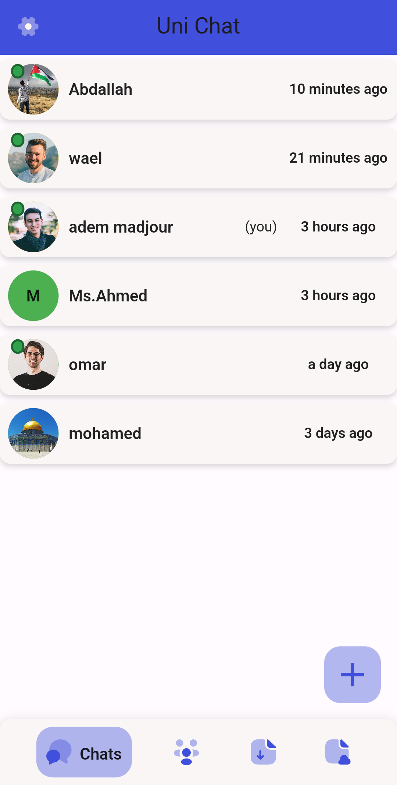

# Uni Chat

Welcome to Uni Chat!

It is a platform that combines instant messaging , file sharing, and task management. It's essentially a digital headquarters for students and teachers, enabling them to communicate and collaborate easily and efficiently. 

## Features ✨

Channels: Organized spaces for teams to discuss specific topics or projects. There are public channels that everyone in the organization can access, and private channels that are only visible to invited members.

Direct messages: One-on-one chat with individual team members.
Shopping cart with effortless quantity adjustments

File sharing: Share files with members (inside channels) or in One-on-one chat or with all users .

Search: Search all of your conversations and files in Slack to find what you're looking for quickly.

Responsive design for optimal viewing on all devices.

**## Technologies Used **

Frontend: flutter / Dart

Backend: PHP / ratchet library for real Time (websockets)

## Screenshots ️

## Contact ✉️

For any questions or feedback, please reach out to adem madjour at madjour.adem@gmail.com .

## Notice 🔔 

run this code on terminal when you open the project : flutter pub get 

